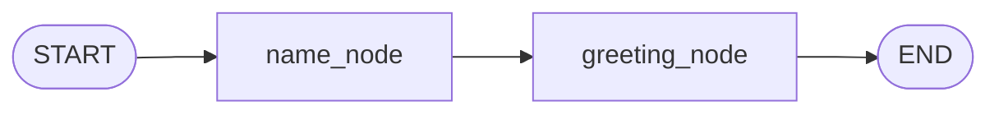

# LangGraph Control Flow: Minimal Greeting Graph

A minimal [LangGraph](https://langchain-ai.github.io/langgraph/) example that shows how a `StateGraph` passes shared state through a linear chain of nodes.

## Overview

The graph takes a `name`, passes it through one node, and builds a `greeting` in the next. It is a good starting point for understanding **state, nodes, edges, and compilation** before moving to conditional routing, tools, or agents.

## Control Flow



| Step | Node            | Reads   | Writes     | Description                                  |
|------|-----------------|---------|------------|----------------------------------------------|
| 1    | `name_node`     | `name`  | `name`     | Pass-through; returns the name unchanged     |
| 2    | `greeting_node` | `name`  | `greeting` | Builds `"Hello <name>!"`                     |

## State Schema

```python
class State(TypedDict):
    name: str
    greeting: str
```

Every node receives the **full current state** and returns a **partial update**. LangGraph merges that update into the state (default behavior: last write wins per key).

### State evolution

| After node      | `name`  | `greeting`      |
|-----------------|---------|-----------------|
| Initial input   | `Rahul` | `""`            |
| `name_node`     | `Rahul` | `""`            |
| `greeting_node` | `Rahul` | `Hello Rahul!`  |

## How It Works

1. **Define state**: `State` is a `TypedDict` that acts as the shared contract between nodes.
2. **Register nodes**: `builder.add_node("name_node", name_node)` maps a string ID to a plain Python function.
3. **Wire edges**: `START → name_node → greeting_node → END` defines a fixed, sequential path.
4. **Compile**: `builder.compile()` validates the graph and returns a runnable.
5. **Invoke**: `graph.invoke(initial_state)` executes the graph and returns the final state.

## Setup

```bash
pip install langgraph
```

## Run

```bash
python Langgraph_flow.py
```

### Expected output

```python
{'name': 'Rahul', 'greeting': 'Hello Rahul!'}
```

## Project Structure

```
.
├── Langgraph_flow.py   # Graph definition and execution
└── README.md
```

## Notes

- `name_node` is intentionally a pass-through. It demonstrates a node that returns a state update without changing the value. In a real graph this is where you would validate or normalize input.
- Edges here are **static**. To branch at runtime, replace `add_edge` with `add_conditional_edges` and a routing function.
- Nodes can return only the keys they modify; unreturned keys remain untouched.

## Next Steps

- Add conditional routing with `add_conditional_edges`
- Use reducers (e.g., `Annotated[list, add]`) for accumulating state
- Introduce an LLM node and tool calling
- Add checkpointing with `MemorySaver` for persistence